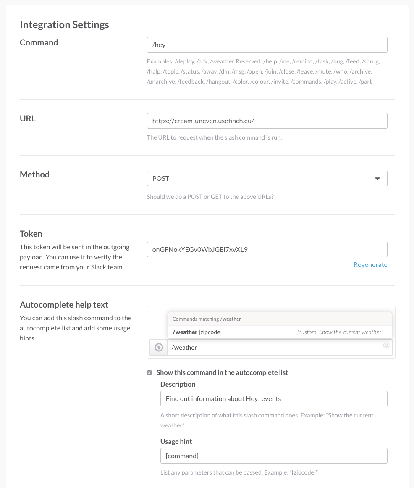

# Slack Bot Example

This is a [Slack](https://slack.com) bot example written in Sinatra. It was written for [this blog post](http://wearestac.com/blog/building-a-slack-slash-command-with-sinatra-finch-and-heroku).

Deploy the application to your host of choice and configure it in Slack like so:

It's a very basic application, usage is as follows:

* `/hey when` - When is the next event
* `/hey what` - Who is speaking at the next event
* `/hey unsupportedcommand` - Respond to missing commands with a friendly error message

For more information, [read the blog post](http://wearestac.com/blog/building-a-slack-slash-command-with-sinatra-finch-and-heroku).
